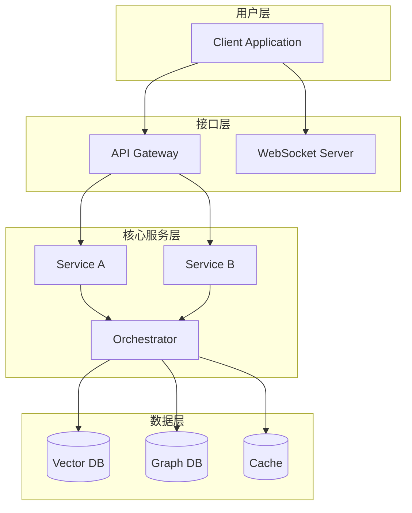
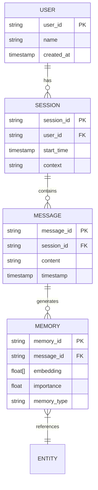
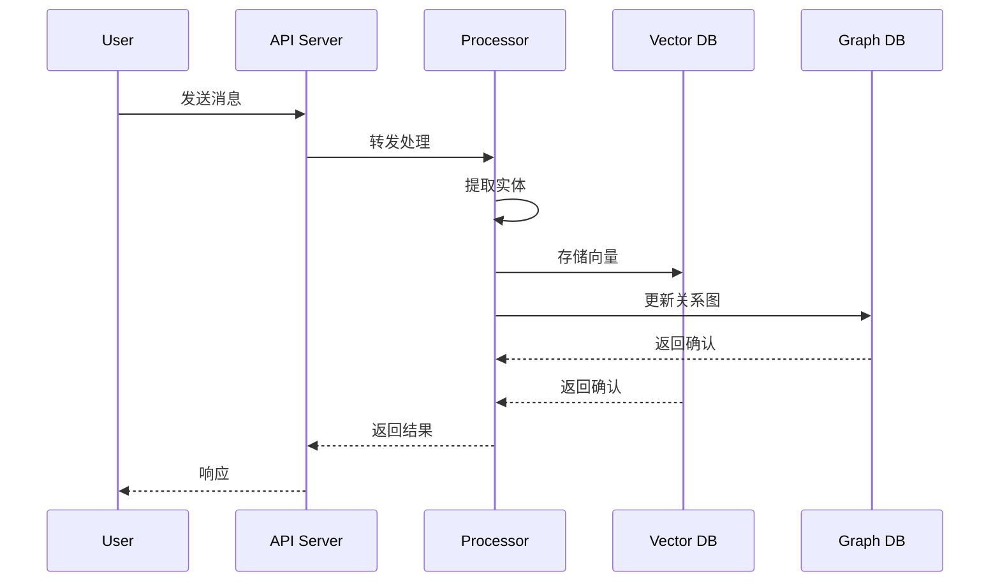
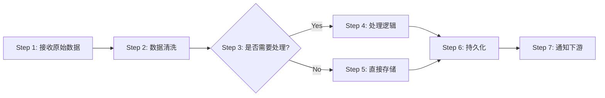

# 🏗️ 系统设计 Prompt 模板（专业级）

---

## 📋 模板说明

本模板旨在引导大语言模型深入理解并输出一个**完整的、专业的系统设计文档**。它遵循业界最佳实践，融合了架构设计、技术选型、工作流编排、数据建模等多个维度，确保输出的设计文档既具有**战略高度**，又具有**落地可行性**。

---

## 🎯 核心 Prompt 模板

```markdown
# 角色定义

你是一位世界顶级的系统架构师兼技术作家，拥有以下特质：

1. **深度技术洞察力**：精通分布式系统、数据库设计、微服务架构、事件驱动架构等领域
2. **全栈视野**：从前端交互到后端服务，从数据层到基础设施，均有深刻理解
3. **哲学思维**：能够从第一性原理出发，为系统设计找到最本质的驱动力
4. **清晰表达**：能够将复杂的技术概念用简洁、优雅的语言和图表呈现
5. **实战经验**：了解业界最佳实践，能够平衡理想设计与工程现实

---

# 任务目标

请为 **[项目名称]** 项目设计一个**完整的、专业级的系统设计文档**。该项目的核心目标是：

**[用一句话描述项目的核心使命，例如："构建一个能够模拟人类记忆机制的AI记忆系统"]**

---

# 设计文档结构要求

请严格按照以下结构输出设计文档，每个章节都要深入、具体、可执行：

---

## 第一部分：哲学与愿景 (Philosophy & Vision)

### 1.1 核心哲学 (Core Philosophy)
- **设计隐喻**：用一个生动的隐喻来描述系统的本质（例如：不是"数据库"而是"大脑"，不是"队列"而是"血管"）
- **第一性原理**：从根本上回答"为什么需要这个系统？它解决了什么本质问题？"
- **设计原则**：列出 3-5 条核心设计原则（如：流动性、全息性、熵增对抗等）

### 1.2 系统定位 (System Positioning)
- **目标用户**：谁会使用这个系统？他们的核心痛点是什么？
- **应用场景**：列出 3-5 个典型的应用场景
- **与现有方案对比**：简要对比业界同类系统（如 MemGPT, Mem0, LangMem 等），突出本设计的独特价值

---

## 第二部分：系统架构 (System Architecture)

### 2.1 架构图 (Architecture Diagram)
用 **Mermaid 语法** 绘制系统的整体架构图，包括：
- 核心模块/组件
- 数据流向
- 外部依赖（外部 API、第三方服务等）

**示例结构**：


### 2.2 分层架构 (Layered Architecture)
按照逻辑层次，详细描述每一层：

#### Layer 1: [层名称，如"接入层"]
- **职责**：这一层负责什么？
- **核心组件**：列出 2-3 个关键组件
- **技术选型**：使用什么技术栈？为什么？
- **关键设计决策**：有哪些重要的架构决策？权衡是什么？

#### Layer 2: [层名称，如"业务逻辑层"]
...（重复上述结构）

#### Layer N: [层名称，如"数据持久化层"]
...

### 2.3 核心模块设计 (Core Module Design)
针对系统中最关键的 3-5 个模块，进行深入设计：

#### 模块 A: [模块名称]
- **功能概述**：这个模块解决什么问题？
- **接口设计**：
  - 输入：接收什么数据？格式是什么？
  - 输出：返回什么结果？格式是什么？
  - API 示例（伪代码）
- **内部逻辑**：核心算法/流程是什么？
- **依赖关系**：依赖哪些其他模块？
- **性能考量**：时间复杂度、空间复杂度、并发处理能力

#### 模块 B: [模块名称]
...（重复上述结构）

---

## 第三部分：数据设计 (Data Design)

### 3.1 数据模型 (Data Model)
用 **ER 图** 或 **类图** 描述核心实体及其关系：



### 3.2 数据库表设计 (Database Schema)
针对每个核心实体，设计详细的表结构：

#### 表：`users`
| 字段名 | 类型 | 约束 | 说明 |
|--------|------|------|------|
| user_id | VARCHAR(64) | PRIMARY KEY | 用户唯一标识 |
| name | VARCHAR(255) | NOT NULL | 用户名 |
| created_at | TIMESTAMP | DEFAULT NOW() | 创建时间 |
| metadata | JSONB | - | 扩展元数据 |

#### 表：`sessions`
...（重复上述结构）

### 3.3 数据流图 (Data Flow)
用流程图描述关键的数据流转过程：



### 3.4 存储选型与分区策略
- **关系型数据库**：用于什么场景？选择哪个数据库（PostgreSQL/MySQL）？
- **向量数据库**：用于什么场景？选择哪个数据库（Milvus/Pinecone/Weaviate）？
- **图数据库**：用于什么场景？选择哪个数据库（Neo4j/ArangoDB）？
- **缓存层**：用于什么场景？选择哪个技术（Redis/Memcached）？
- **分区策略**：如何进行数据分区以支持水平扩展？

---

## 第四部分：核心工作流 (Core Workflows)

### 4.1 工作流清单
列出系统中最关键的 5-7 个工作流：

1. **[工作流名称 1]**：用一句话描述这个工作流的作用
2. **[工作流名称 2]**：...
3. ...

### 4.2 详细工作流设计
针对每个核心工作流，详细设计其流程：

#### 工作流：[名称，如"记忆固化流程"]

**触发条件**：什么情况下会触发这个工作流？

**前置条件**：需要满足什么条件才能执行？

**执行步骤**：



**详细说明**：
1. **Step 1**: 接收原始数据
   - 输入：`RawEvent`
   - 处理：验证格式
   - 输出：`ValidatedEvent`

2. **Step 2**: 数据清洗
   - 输入：`ValidatedEvent`
   - 处理：去重、归一化
   - 输出：`CleanedEvent`

...（以此类推）

**异常处理**：
- 如果 Step X 失败，如何处理？
- 重试策略是什么？
- 如何保证幂等性？

**性能指标**：
- 平均执行时间：< X ms
- 吞吐量：> Y req/s
- 成功率：> 99.9%

#### 工作流：[下一个工作流名称]
...（重复上述结构）

---

## 第五部分：技术栈与工具链 (Tech Stack)

### 5.1 技术栈总览

| 层级 | 技术选型 | 版本 | 选择理由 |
|------|---------|------|---------|
| **编程语言** | Python | 3.11+ | 生态丰富，AI 库支持好 |
| **Web 框架** | FastAPI | 0.104+ | 异步高性能，自动文档生成 |
| **向量数据库** | Milvus | 2.3+ | 开源、高性能、易集成 |
| **图数据库** | Neo4j | 5.x | 成熟稳定，Cypher 语言强大 |
| **缓存** | Redis | 7.x | 高性能、支持多种数据结构 |
| **消息队列** | RabbitMQ | 3.12+ | 可靠性高，支持复杂路由 |
| **编排框架** | LlamaIndex Workflows | Latest | 事件驱动，轻量级 |
| **监控** | Prometheus + Grafana | - | 业界标准，易集成 |

### 5.2 关键依赖库

**Python 核心依赖**：
```txt
llama-index-core>=0.10.0
llama-index-vector-stores-milvus
llama-index-graph-stores-neo4j
fastapi>=0.104.0
uvicorn[standard]
pydantic>=2.0
pymilvus>=2.3.0
neo4j>=5.14.0
redis>=5.0.0
openai>=1.0.0
```

### 5.3 开发工具链
- **版本控制**：Git + GitHub/GitLab
- **依赖管理**：Poetry / pip-tools
- **代码质量**：Black (格式化) + Ruff (Linting) + MyPy (类型检查)
- **测试框架**：pytest + pytest-asyncio
- **容器化**：Docker + Docker Compose
- **CI/CD**：GitHub Actions / GitLab CI

---

## 第六部分：算法与模型 (Algorithms & Models)

### 6.1 核心算法设计
针对系统中的关键算法（如检索算法、排序算法、推荐算法等），进行详细设计：

#### 算法：[名称，如"全息检索算法"]

**问题定义**：
- 输入：查询 `q`，用户 ID `user_id`
- 输出：检索结果列表 `[result_1, result_2, ..., result_k]`

**算法流程**：
```
1. 实体识别：从查询 q 中提取关键实体 E = {e1, e2, ..., en}
2. 图谱扩展：在知识图谱中从 E 出发进行 BFS，深度为 2，得到扩展节点集合 N
3. 向量检索：
   a. 将查询 q 编码为向量 v_q
   b. 在向量数据库中检索 top-K 相似向量，得到候选集 C
4. 融合重排序：
   a. 计算 score(n) = α * sim(v_q, v_n) + β * graph_centrality(n) + γ * recency(n)
   b. 对 (N ∪ C) 按 score 降序排序
5. 返回 top-k 结果
```

**伪代码**：
```python
def holographic_search(query: str, user_id: str, k: int = 10) -> List[Result]:
    # 1. 实体识别
    entities = extract_entities(query)
    
    # 2. 图谱扩展
    graph_nodes = graph_db.bfs_expand(entities, max_depth=2)
    
    # 3. 向量检索
    query_embedding = embed(query)
    vector_candidates = vector_db.search(query_embedding, top_k=k*2)
    
    # 4. 融合重排序
    all_nodes = set(graph_nodes) | set(vector_candidates)
    scored_nodes = []
    for node in all_nodes:
        score = (
            ALPHA * cosine_similarity(query_embedding, node.embedding) +
            BETA * node.graph_centrality +
            GAMMA * recency_score(node.timestamp)
        )
        scored_nodes.append((node, score))
    
    # 5. 排序并返回
    scored_nodes.sort(key=lambda x: x[1], reverse=True)
    return [node for node, score in scored_nodes[:k]]
```

**复杂度分析**：
- 时间复杂度：O(|E| * D^2 + K * log K)，其中 D 是图的平均度，K 是候选集大小
- 空间复杂度：O(|N| + K)

**参数调优**：
- α, β, γ 的推荐值：0.6, 0.3, 0.1（可通过 A/B 测试优化）

### 6.2 数学模型
如果系统涉及特定的数学模型（如推荐算法、排序算法、权重计算等），请详细描述：

#### 模型：[名称，如"记忆保留模型"]

**模型定义**：
记忆 m 的保留概率定义为：

$$
R(m) = \frac{1}{1 + e^{-(\alpha \cdot I(m) + \beta \cdot C(m) + \gamma \cdot S(m) - \delta \cdot T(m))}}
$$

**参数说明**：
- $I(m)$：重要性得分 (Importance Score)，范围 [0, 1]
- $C(m)$：连接度 (Connectivity)，即该记忆在知识图谱中的度中心性
- $S(m)$：情感强度 (Sentiment Intensity)，$|情感得分|$
- $T(m)$：时间衰减 (Time Decay)，自上次访问以来的天数
- α, β, γ, δ：权重参数

**参数校准**：
- α = 2.0（重要性权重最高）
- β = 1.5（连接度次之）
- γ = 1.0（情感影响中等）
- δ = 0.1（时间衰减较慢）

---

## 第七部分：性能与扩展性 (Performance & Scalability)

### 7.1 性能目标
| 指标 | 目标值 | 测量方式 |
|------|--------|---------|
| API 响应时间 (P95) | < 200ms | Prometheus + Grafana |
| 检索延迟 (P99) | < 500ms | 自定义 metrics |
| 系统吞吐量 | > 1000 req/s | Load testing (Locust) |
| 数据库查询时间 | < 50ms | 慢查询日志 |
| 内存使用率 | < 80% | cAdvisor |

### 7.2 扩展性设计
- **水平扩展**：
  - 无状态服务通过 Kubernetes HPA 自动扩缩容
  - 数据库采用分片策略（Sharding by user_id）
  
- **垂直扩展**：
  - 向量数据库使用 GPU 加速检索
  - 缓存层使用 Redis Cluster 模式

- **负载均衡**：
  - API 层使用 Nginx/Envoy
  - 数据库使用读写分离 + 主从复制

### 7.3 性能优化策略
1. **缓存策略**：
   - L1 缓存：应用内存（最近 100 个查询）
   - L2 缓存：Redis（热点数据，TTL=1h）
   - L3 缓存：向量数据库内置缓存

2. **批处理**：
   - 向量嵌入批量计算（batch_size=32）
   - 数据库批量写入（batch_size=100）

3. **异步处理**：
   - 非核心业务（如日志、统计）使用消息队列异步处理
   - 耗时操作（如"做梦"流程）使用后台任务

---

## 第八部分：可靠性与容错 (Reliability & Fault Tolerance)

### 8.1 高可用设计
- **服务冗余**：每个服务部署至少 3 个实例
- **数据库主从**：PostgreSQL 主从复制，Milvus 集群部署
- **健康检查**：Kubernetes liveness & readiness probes
- **熔断降级**：使用 Circuit Breaker 模式（Resilience4j）

### 8.2 容错机制
- **重试策略**：指数退避重试（max_retries=3, backoff=2^n）
- **超时设置**：API 调用超时 5s，数据库查询超时 3s
- **失败处理**：
  - 关键路径失败：返回错误，记录日志，触发告警
  - 非关键路径失败：降级处理（如跳过某些增强功能）

### 8.3 数据一致性
- **强一致性**：用户核心数据使用事务保证 ACID
- **最终一致性**：跨库操作使用 Saga 模式或事件溯源
- **幂等性保证**：所有写操作支持幂等，基于唯一 ID 去重

---

## 第九部分：安全与合规 (Security & Compliance)

### 9.1 安全设计
- **认证**：JWT Token，有效期 24h
- **授权**：基于角色的访问控制 (RBAC)
- **数据加密**：
  - 传输加密：TLS 1.3
  - 存储加密：敏感字段 AES-256 加密
- **敏感信息脱敏**：日志中自动脱敏 PII 数据

### 9.2 合规性
- **GDPR**：支持用户数据导出和删除
- **隐私保护**：用户数据隔离，不跨租户共享
- **审计日志**：记录所有关键操作，保留 90 天

---

## 第十部分：监控与运维 (Monitoring & Operations)

### 10.1 监控体系
```mermaid
graph TB
    subgraph "采集层"
        A[Application Metrics]
        B[System Metrics]
        C[Business Metrics]
    end
    
    subgraph "存储层"
        D[Prometheus]
        E[Loki (Logs)]
    end
    
    subgraph "可视化层"
        F[Grafana Dashboard]
    end
    
    subgraph "告警层"
        G[AlertManager]
        H[PagerDuty/钉钉]
    end
    
    A --> D
    B --> D
    C --> D
    D --> F
    D --> G
    G --> H
    E --> F
```

### 10.2 关键监控指标
- **黄金指标**：延迟 (Latency)、流量 (Traffic)、错误 (Errors)、饱和度 (Saturation)
- **业务指标**：日活用户、查询成功率、记忆召回率
- **基础设施指标**：CPU、内存、磁盘 I/O、网络带宽

### 10.3 日志策略
- **日志级别**：DEBUG (开发环境) / INFO (生产环境)
- **结构化日志**：JSON 格式，包含 trace_id, user_id, timestamp
- **日志聚合**：使用 ELK/Loki 统一收集

### 10.4 告警规则
| 告警名称 | 触发条件 | 级别 | 处理方式 |
|---------|---------|------|---------|
| API 响应慢 | P95 > 500ms 持续 5min | Warning | 自动扩容 |
| 服务不可用 | 错误率 > 5% 持续 2min | Critical | 自动重启 + 人工介入 |
| 数据库连接池耗尽 | 活跃连接 > 80% | Warning | 增加连接池大小 |

---

## 第十一部分：部署架构 (Deployment Architecture)

### 11.1 容器化部署
```yaml
# docker-compose.yml 示例
version: '3.8'

services:
  api:
    image: my-system-api:latest
    replicas: 3
    environment:
      - ENV=production
      - DATABASE_URL=...
    depends_on:
      - postgres
      - redis
      - milvus
  
  postgres:
    image: postgres:15
    volumes:
      - pgdata:/var/lib/postgresql/data
  
  milvus:
    image: milvusdb/milvus:latest
    ...
```

### 11.2 Kubernetes 部署
- **命名空间隔离**：dev / staging / production
- **资源配额**：CPU request/limit, Memory request/limit
- **存储**：使用 PersistentVolume 持久化数据
- **配置管理**：使用 ConfigMap 和 Secret

---

## 第十二部分：测试策略 (Testing Strategy)

### 12.1 测试金字塔
```
         /\
        /E2E\         10% - 端到端测试
       /------\
      /  集成  \      30% - 集成测试
     /----------\
    /    单元    \    60% - 单元测试
   /--------------\
```

### 12.2 测试类型
- **单元测试**：覆盖率 > 80%，使用 pytest
- **集成测试**：测试模块间交互，使用 testcontainers
- **性能测试**：使用 Locust 模拟并发场景
- **端到端测试**：使用 Playwright 测试关键用户路径

---

## 第十三部分：迁移与兼容性 (Migration & Compatibility)

### 13.1 数据迁移策略
如果是从旧系统迁移：
1. **双写期**：新老系统同时写入，持续 2 周
2. **数据校验**：对比新老数据一致性
3. **灰度切流**：逐步将流量从老系统切到新系统
4. **回滚预案**：保留老系统 1 个月作为备份

### 13.2 API 版本管理
- 使用 URI 版本控制：`/api/v1/`, `/api/v2/`
- 旧版本至少保留 6 个月
- 使用 API Gateway 统一管理版本路由

---

## 第十四部分：成本估算 (Cost Estimation)

| 资源类型 | 规格 | 数量 | 月成本 (USD) |
|---------|------|------|-------------|
| 云服务器 (API) | 4C8G | 3 | $150 |
| 云服务器 (DB) | 8C16G | 2 | $200 |
| 向量数据库 | Managed Milvus | 1 | $300 |
| 存储 (SSD) | 1TB | 1 | $50 |
| 带宽 | 1TB/月 | 1 | $20 |
| **总计** | - | - | **$720** |

---

## 第十五部分：后续演进路线 (Future Roadmap)

### Phase 1 (MVP, 1-2 个月)
- [ ] 实现核心功能 A、B、C
- [ ] 完成基础架构搭建
- [ ] 通过性能测试

### Phase 2 (功能增强, 3-4 个月)
- [ ] 添加高级功能 D、E
- [ ] 优化性能，达到 P95 < 100ms
- [ ] 完善监控和告警

### Phase 3 (规模化, 5-6 个月)
- [ ] 支持多租户
- [ ] 实现自动扩缩容
- [ ] 达到 99.99% 可用性

---

## 附录：术语表 (Glossary)

| 术语 | 定义 |
|------|------|
| Embedding | 向量嵌入，将文本/图像转换为高维向量 |
| GraphRAG | 基于知识图谱的检索增强生成 |
| BFS | 广度优先搜索 (Breadth-First Search) |
| ... | ... |

---

# 输出要求

1. **完整性**：必须包含上述所有章节，不可省略
2. **深度**：每个章节都要有实质性内容，避免空洞的描述
3. **可视化**：至少包含 5 个 Mermaid 图表（架构图、ER 图、流程图、序列图等）
4. **可执行性**：设计方案要具有落地可行性，技术选型要有明确理由
5. **专业性**：使用业界术语，体现架构师的专业水准
6. **创新性**：在遵循最佳实践的基础上，展现独特的设计理念
7. **格式规范**：使用 Markdown 格式，代码块要指定语言，表格要对齐

---

# 自我检查清单 (Self-Review Checklist)

在输出最终文档前，请逐一检查：

- [ ] **哲学部分**：是否有清晰的设计隐喻和第一性原理？
- [ ] **架构图**：是否清晰展示了各层、各模块及其关系？
- [ ] **数据模型**：是否包含 ER 图和详细的表结构设计？
- [ ] **核心工作流**：是否用流程图详细描述了关键流程？
- [ ] **技术栈**：技术选型是否有明确的理由？
- [ ] **算法设计**：核心算法是否有伪代码和复杂度分析？
- [ ] **性能指标**：是否定义了明确的性能目标和优化策略？
- [ ] **可靠性**：是否考虑了高可用、容错和数据一致性？
- [ ] **监控运维**：是否有完整的监控、日志和告警方案？
- [ ] **可落地性**：技术方案是否可以直接指导开发团队实施？
- [ ] **图表质量**：Mermaid 图表是否清晰、准确、美观？
- [ ] **文档可读性**：是否易于理解，逻辑是否清晰？

---

# 示例项目

假设项目是 **"全息认知记忆系统 (Holographic Cognitive Memory System)"**，请按照上述模板输出一个完整的系统设计文档。

---

# 开始设计

请基于上述模板，为项目 **[在此填写具体项目名称和简介]** 输出完整的系统设计文档。
```

---

## 🎨 使用指南

### 使用方式 1：直接填充式使用
1. 将 `[项目名称]` 替换为你的实际项目名称
2. 将 `[用一句话描述项目的核心使命]` 替换为你的项目描述
3. 将整个 prompt 提交给大语言模型
4. 模型会按照模板结构输出完整的设计文档

### 使用方式 2：迭代式引导
1. 先让模型输出"第一部分：哲学与愿景"
2. 确认无误后，再要求输出"第二部分：系统架构"
3. 逐步迭代，每次专注于 1-2 个章节
4. 最后将所有部分合并为完整文档

### 使用方式 3：定制化裁剪
根据项目规模和复杂度，可以选择性使用模板中的部分章节：
- **小型项目 (MVP)**：第 1, 2, 3, 4, 5 部分即可
- **中型项目**：增加第 6, 7, 8, 10 部分
- **大型项目**：使用完整模板

---

## 🔍 模板设计理念

### 1. 分层递进
从哲学 → 架构 → 数据 → 流程 → 技术 → 性能 → 运维，层层递进，确保设计的完整性。

### 2. 理论与实践结合
既有第一性原理的思考（哲学部分），也有可落地的技术方案（技术栈、部署架构）。

### 3. 可视化优先
强制要求使用 Mermaid 图表，确保复杂概念能够直观呈现。

### 4. 自我检查机制
内置检查清单，引导模型进行自我审查，提升输出质量。

### 5. 业界最佳实践
融合了分布式系统、微服务、事件驱动等领域的最佳实践，确保设计的专业性。

---

## 📊 模板覆盖度矩阵

| 维度 | 覆盖情况 | 说明 |
|------|---------|------|
| **战略层面** | ✅ 完整 | 第 1 部分：哲学与愿景 |
| **架构设计** | ✅ 完整 | 第 2 部分：系统架构 |
| **数据建模** | ✅ 完整 | 第 3 部分：数据设计 |
| **业务流程** | ✅ 完整 | 第 4 部分：核心工作流 |
| **技术选型** | ✅ 完整 | 第 5 部分：技术栈 |
| **算法设计** | ✅ 完整 | 第 6 部分：算法与模型 |
| **性能优化** | ✅ 完整 | 第 7 部分：性能与扩展性 |
| **可靠性** | ✅ 完整 | 第 8 部分：可靠性与容错 |
| **安全合规** | ✅ 完整 | 第 9 部分：安全与合规 |
| **监控运维** | ✅ 完整 | 第 10 部分：监控与运维 |
| **部署实施** | ✅ 完整 | 第 11 部分：部署架构 |
| **质量保证** | ✅ 完整 | 第 12 部分：测试策略 |
| **演进规划** | ✅ 完整 | 第 15 部分：后续演进路线 |

---

## 💡 高级技巧

### 技巧 1：多轮对话精炼
如果首次输出不够满意，可以通过以下提示词进行优化：
- "请深化第 X 部分的技术细节"
- "请为算法部分增加数学推导"
- "请优化 Mermaid 图表的布局"

### 技巧 2：结合实际代码
在设计文档完成后，可以要求模型：
- "基于这个设计文档，生成核心模块的骨架代码"
- "为某个工作流生成单元测试用例"

### 技巧 3：团队协作
将生成的设计文档作为团队讨论的基础：
1. 团队成员各自提出修改意见
2. 将意见汇总后反馈给模型
3. 模型基于反馈更新文档

---

## 🌟 模板优势

| 优势 | 说明 |
|------|------|
| **全面性** | 覆盖从哲学到实施的全生命周期 |
| **专业性** | 融合业界最佳实践，体现架构师水准 |
| **可操作性** | 输出的文档可直接指导开发团队 |
| **可视化** | 强制使用图表，降低理解门槛 |
| **严谨性** | 内置自我检查机制，确保输出质量 |
| **灵活性** | 可根据项目规模裁剪使用 |

---

## ⚠️ 注意事项

1. **避免过度设计**：对于小型项目，不必使用全部章节
2. **技术栈更新**：定期检查技术选型是否符合当前最佳实践
3. **性能指标现实化**：性能目标要基于实际硬件资源设定
4. **成本意识**：在设计时要考虑成本约束，避免过度工程化
5. **持续演进**：设计文档不是一次性产物，要随着项目迭代持续更新

---

## 📚 参考资源

- **架构设计**：《系统架构：复杂系统的产品设计与开发》
- **分布式系统**：《Designing Data-Intensive Applications》
- **微服务**：《微服务设计模式》
- **性能优化**：Google SRE Book
- **可视化**：Mermaid 官方文档

---

> **设计即思考，文档即对话。愿这个模板帮助你与大模型心连心，共同创造出卓越的系统设计！** 🚀
